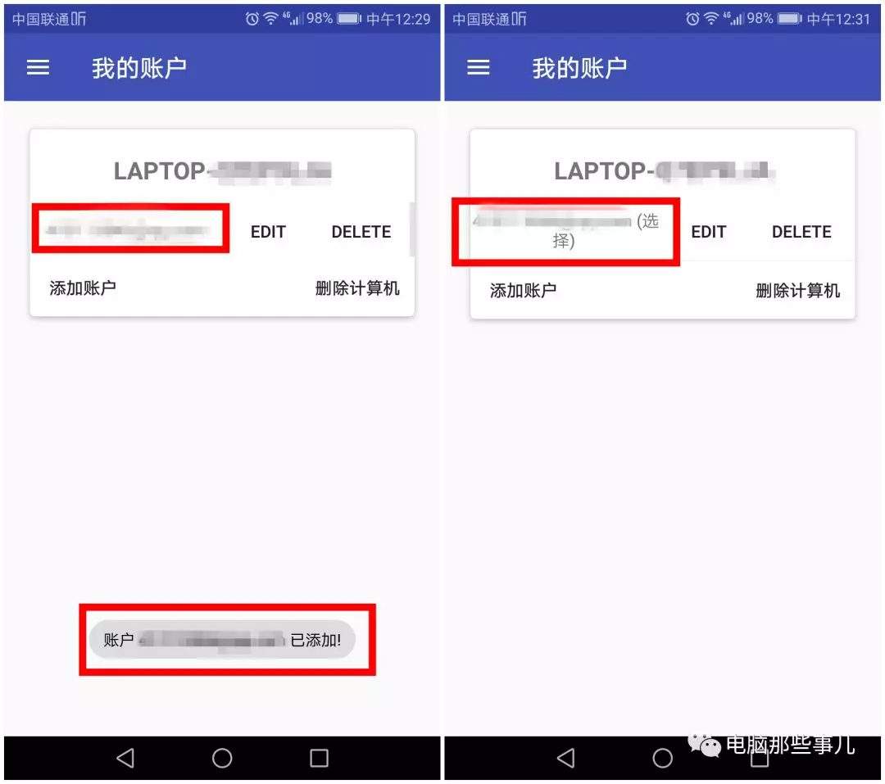

1.首先保证手机与电脑在同一个`wifi`下或者自己开一个热点
2.**2、**首先解压电脑端指纹开机工具，点击`“exe”`文件完成安装，安装后在电脑锁屏界面左下角，会出现指纹解锁选项。（电脑端设置完毕）

**3、**安装手机端指纹解锁`app`，打开后把手指放在手机的指纹区域，软件会自动录入一次指纹。
**4、**点击左上角菜单，选择“扫描”。然后向下拉或者点击右下角刷新按钮。

**5、**（保持电脑在锁屏界面）软件会扫描出你的电脑，如果扫描不出来，请尝试关闭电脑防火墙。点击你的电脑，在“添加计算机”页面选择“保存”！

**6、**点击“管理账户”→“添加账户”
**7、**输入电脑的用户名和密码（别弄错啦），验证下指纹，然后点击保存。

**8、**点击下自己的用户名，（**会显示选择二字，表示成功**）

9、点击右上角菜单按钮，选择解锁。当电脑处于锁屏界面，手指放在指纹区域，会发现电脑自动解锁啦~

